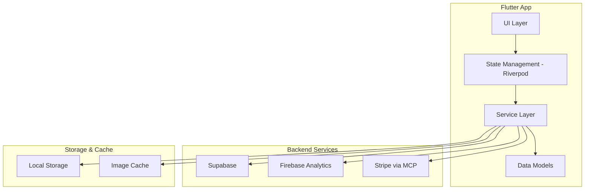
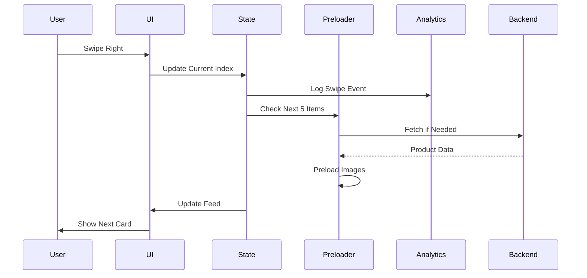
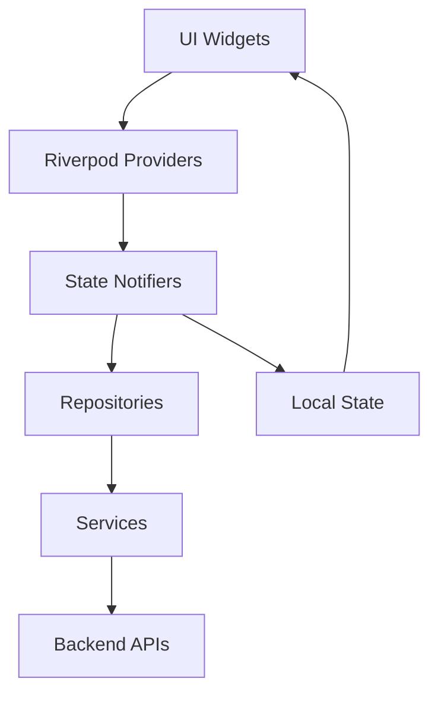

# SWIRL - Technical Architecture & Implementation Plan

**Version:** 2.0 (Updated to align with PRD v1.0)
**Last Updated:** November 12, 2025

## 🎯 Project Overview

SWIRL is a personalized fashion discovery platform for the UAE/Middle East market, built with Flutter, featuring:
- AI-driven swipe-based product discovery from UAE stores (Amazon, Noon, Namshi)
- Comprehensive ML-ready swipe tracking (dwell time, context, implicit signals)
- Multi-select style filters with soft bias ranking
- Brand following with feed prioritization
- Weekly personalized outfit recommendations (coordinated outfits + individual items)
- Anonymous-first authentication with seamless migration
- Supabase backend with Amazon API integration (mock data Phase 1)

---

## 📐 System Architecture



---

## 🏗️ Project Structure

```
swirl/
├── lib/
│   ├── main.dart
│   ├── app.dart
│   │
│   ├── core/
│   │   ├── theme/
│   │   │   ├── swirl_colors.dart
│   │   │   ├── swirl_typography.dart
│   │   │   └── swirl_theme.dart
│   │   ├── constants/
│   │   │   └── app_constants.dart
│   │   └── utils/
│   │       ├── haptics.dart
│   │       └── image_preloader.dart
│   │
│   ├── features/
│   │   ├── home/
│   │   │   ├── presentation/
│   │   │   │   ├── home_screen.dart
│   │   │   │   ├── widgets/
│   │   │   │   │   ├── product_card.dart
│   │   │   │   │   ├── card_stack.dart
│   │   │   │   │   ├── swipeable_card.dart
│   │   │   │   │   ├── like_indicator.dart
│   │   │   │   │   └── floating_bottom_nav.dart
│   │   │   ├── providers/
│   │   │   │   ├── feed_provider.dart
│   │   │   │   └── swipe_provider.dart
│   │   │   └── logic/
│   │   │       ├── feed_preloader.dart
│   │   │       └── surprise_injector.dart
│   │   │
│   │   ├── detail/
│   │   │   ├── presentation/
│   │   │   │   ├── detail_view.dart
│   │   │   │   └── widgets/
│   │   │   │       ├── image_carousel.dart
│   │   │   │       ├── size_selector.dart
│   │   │   │       └── additional_images.dart
│   │   │   └── providers/
│   │   │       └── detail_provider.dart
│   │   │
│   │   ├── wishlist/
│   │   │   ├── presentation/
│   │   │   │   └── wishlist_screen.dart
│   │   │   └── providers/
│   │   │       └── wishlist_provider.dart
│   │   │
│   │   ├── cart/
│   │   │   ├── presentation/
│   │   │   │   └── cart_screen.dart
│   │   │   └── providers/
│   │   │       └── cart_provider.dart
│   │   │
│   │   └── search/
│   │       ├── presentation/
│   │       │   └── search_screen.dart
│   │       └── providers/
│   │           └── search_provider.dart
│   │
│   ├── data/
│   │   ├── models/
│   │   │   ├── product.dart
│   │   │   ├── user.dart
│   │   │   └── cart_item.dart
│   │   ├── repositories/
│   │   │   ├── product_repository.dart
│   │   │   ├── user_repository.dart
│   │   │   └── analytics_repository.dart
│   │   └── services/
│   │       ├── supabase_service.dart
│   │       ├── firebase_service.dart
│   │       ├── recommendation_service.dart
│   │       └── stripe_service.dart
│   │
│   └── shared/
│       ├── widgets/
│       │   ├── shimmer_placeholder.dart
│       │   └── error_placeholder.dart
│       └── extensions/
│           └── context_extensions.dart
│
├── assets/
│   ├── fonts/
│   │   └── inter/
│   ├── images/
│   │   └── LOGO.png
│   └── mock_data/
│       └── products.json
│
├── test/
├── pubspec.yaml
└── README.md
```

---

## 🔄 Data Flow Diagrams

### Swipe Interaction Flow



### Feed Preloading Strategy

```mermaid
graph LR
    Current[Current: 0] --> Next1[Loaded: +1]
    Next1 --> Next2[Loaded: +2]
    Next2 --> Next3[Loaded: +3]
    Next3 --> Next4[Loaded: +4]
    Next4 --> Next5[Loaded: +5]
    Next5 --> Queue1[Queue: +6]
    Queue1 --> Queue2[Queue: +7-10]
    Queue2 --> Fetch[Fetch: +11-20]
    
    style Current fill:#4ade80
    style Next1 fill:#86efac
    style Next2 fill:#86efac
    style Next3 fill:#86efac
    style Next4 fill:#86efac
    style Next5 fill:#86efac
    style Queue1 fill:#fbbf24
    style Queue2 fill:#fbbf24
    style Fetch fill:#f87171
```



---

## 🗄️ Database Schema (Supabase)

### Users Table
```sql
CREATE TABLE users (
  id UUID PRIMARY KEY DEFAULT uuid_generate_v4(),

  -- Anonymous tracking
  anonymous_id UUID UNIQUE,
  is_anonymous BOOLEAN DEFAULT true,

  -- Auth (when user signs up)
  email TEXT UNIQUE,
  phone TEXT UNIQUE,
  auth_provider TEXT, -- 'email', 'google', 'apple', 'phone'

  -- Profile
  display_name TEXT,
  avatar_url TEXT,

  -- Onboarding data
  gender_preference TEXT, -- 'men', 'women', 'both', null
  style_preferences TEXT[], -- ['minimalist', 'urban_vibe', 'streetwear_edge', 'avant_garde']
  price_tier TEXT, -- 'budget', 'mid_range', 'premium', 'luxury'

  -- Computed preferences (ML-driven)
  preferred_categories TEXT[] DEFAULT ARRAY[]::TEXT[],
  preferred_brands TEXT[] DEFAULT ARRAY[]::TEXT[],
  preferred_colors TEXT[] DEFAULT ARRAY[]::TEXT[],
  avg_liked_price DECIMAL(10,2),

  -- Stats
  total_swirls INTEGER DEFAULT 0,
  total_swipes INTEGER DEFAULT 0,
  days_active INTEGER DEFAULT 0,

  -- Metadata
  device_locale TEXT DEFAULT 'en-AE',
  timezone TEXT DEFAULT 'Asia/Dubai',
  created_at TIMESTAMPTZ DEFAULT NOW(),
  updated_at TIMESTAMPTZ DEFAULT NOW(),
  last_seen_at TIMESTAMPTZ DEFAULT NOW()
);

CREATE INDEX idx_users_anonymous ON users(anonymous_id);
CREATE INDEX idx_users_email ON users(email);
CREATE INDEX idx_users_last_seen ON users(last_seen_at);
```

### Products Table
```sql
CREATE TABLE products (
  id UUID PRIMARY KEY DEFAULT uuid_generate_v4(),

  -- Source data (Amazon API)
  external_id TEXT UNIQUE NOT NULL, -- Amazon ASIN
  source_store TEXT NOT NULL, -- 'amazon', 'noon', 'namshi'
  source_url TEXT NOT NULL,

  -- Basic info
  name TEXT NOT NULL,
  brand TEXT NOT NULL,
  description TEXT,

  -- Pricing
  price DECIMAL(10,2) NOT NULL,
  original_price DECIMAL(10,2),
  currency TEXT DEFAULT 'AED',
  discount_percentage INTEGER DEFAULT 0,

  -- Classification
  category TEXT NOT NULL, -- 'men', 'women', 'unisex', 'accessories', 'shoes'
  subcategory TEXT, -- 'shirts', 'pants', 'dresses', etc.
  style_tags TEXT[] DEFAULT ARRAY[]::TEXT[], -- ML-generated or manual

  -- Product details
  sizes TEXT[] DEFAULT ARRAY[]::TEXT[],
  colors TEXT[] DEFAULT ARRAY[]::TEXT[],
  materials TEXT,
  care_instructions TEXT,

  -- Images
  primary_image_url TEXT NOT NULL,
  additional_images TEXT[] DEFAULT ARRAY[]::TEXT[],
  cdn_primary_image TEXT, -- Our CDN mirror
  cdn_thumbnail TEXT,
  cdn_medium TEXT,

  -- Quality metrics
  rating DECIMAL(2,1) DEFAULT 0,
  review_count INTEGER DEFAULT 0,

  -- Flags
  is_trending BOOLEAN DEFAULT false,
  is_new_arrival BOOLEAN DEFAULT false,
  is_flash_sale BOOLEAN DEFAULT false,
  is_in_stock BOOLEAN DEFAULT true,
  stock_count INTEGER DEFAULT 100,

  -- ML embeddings
  embedding VECTOR(512), -- pgvector extension

  -- Metadata
  metadata JSONB,
  created_at TIMESTAMPTZ DEFAULT NOW(),
  updated_at TIMESTAMPTZ DEFAULT NOW(),
  last_synced_at TIMESTAMPTZ DEFAULT NOW()
);

CREATE INDEX idx_products_category ON products(category);
CREATE INDEX idx_products_brand ON products(brand);
CREATE INDEX idx_products_price ON products(price);
CREATE INDEX idx_products_style_tags ON products USING GIN(style_tags);
CREATE INDEX idx_products_trending ON products(is_trending) WHERE is_trending = true;
CREATE INDEX idx_products_new ON products(is_new_arrival) WHERE is_new_arrival = true;
-- CREATE INDEX idx_products_embedding ON products USING ivfflat(embedding vector_cosine_ops) WITH (lists = 100);
```

### Swipes Table (Comprehensive Tracking)
```sql
CREATE TABLE swipes (
  id UUID PRIMARY KEY DEFAULT uuid_generate_v4(),

  -- Identifiers
  user_id UUID NOT NULL REFERENCES users(id) ON DELETE CASCADE,
  product_id UUID NOT NULL REFERENCES products(id) ON DELETE CASCADE,
  session_id UUID,

  -- Swipe data
  direction TEXT NOT NULL, -- 'right', 'left', 'up', 'down'
  swipe_action TEXT NOT NULL, -- 'like', 'details_view', 'skip', 'wishlist'

  -- Engagement metrics (ML features)
  dwell_ms INTEGER,
  card_position INTEGER,
  is_repeat_view BOOLEAN DEFAULT false,

  -- Product snapshot (denormalized for ML)
  price DECIMAL(10,2),
  currency TEXT DEFAULT 'AED',
  brand TEXT,
  category TEXT,
  subcategory TEXT,
  style_tags TEXT[] DEFAULT ARRAY[]::TEXT[],

  -- Context
  device_locale TEXT,
  device_platform TEXT, -- 'ios', 'android'
  active_style_filters TEXT[] DEFAULT ARRAY[]::TEXT[],
  time_of_day INTEGER, -- 0-23
  day_of_week INTEGER, -- 0=Sunday, 6=Saturday

  created_at TIMESTAMPTZ DEFAULT NOW()
);

CREATE INDEX idx_swipes_user ON swipes(user_id);
CREATE INDEX idx_swipes_product ON swipes(product_id);
CREATE INDEX idx_swipes_direction ON swipes(direction);
CREATE INDEX idx_swipes_action ON swipes(swipe_action);
CREATE INDEX idx_swipes_session ON swipes(session_id);
CREATE INDEX idx_swipes_created ON swipes(created_at);
```

### Brands Table
```sql
CREATE TABLE brands (
  id UUID PRIMARY KEY DEFAULT uuid_generate_v4(),

  name TEXT UNIQUE NOT NULL,
  slug TEXT UNIQUE NOT NULL,
  logo_url TEXT,
  description TEXT,
  website_url TEXT,

  style_tags TEXT[] DEFAULT ARRAY[]::TEXT[],
  primary_category TEXT,

  total_products INTEGER DEFAULT 0,
  avg_price DECIMAL(10,2),
  follower_count INTEGER DEFAULT 0,

  created_at TIMESTAMPTZ DEFAULT NOW(),
  updated_at TIMESTAMPTZ DEFAULT NOW()
);

CREATE INDEX idx_brands_name ON brands(name);
CREATE INDEX idx_brands_slug ON brands(slug);
```

### Brand Follows Table
```sql
CREATE TABLE brand_follows (
  id UUID PRIMARY KEY DEFAULT uuid_generate_v4(),
  user_id UUID NOT NULL REFERENCES users(id) ON DELETE CASCADE,
  brand_id UUID NOT NULL REFERENCES brands(id) ON DELETE CASCADE,

  source TEXT, -- 'manual', 'auto_5_likes', 'onboarding'
  created_at TIMESTAMPTZ DEFAULT NOW(),

  UNIQUE(user_id, brand_id)
);

CREATE INDEX idx_brand_follows_user ON brand_follows(user_id);
CREATE INDEX idx_brand_follows_brand ON brand_follows(brand_id);
```

### Swirls (Liked Items) Table
```sql
CREATE TABLE swirls (
  id UUID PRIMARY KEY DEFAULT uuid_generate_v4(),
  user_id UUID NOT NULL REFERENCES users(id) ON DELETE CASCADE,
  product_id UUID NOT NULL REFERENCES products(id) ON DELETE CASCADE,

  source TEXT, -- 'swipe_right', 'swipe_down', 'double_tap', 'detail_view'
  created_at TIMESTAMPTZ DEFAULT NOW(),

  UNIQUE(user_id, product_id)
);

CREATE INDEX idx_swirls_user ON swirls(user_id);
CREATE INDEX idx_swirls_product ON swirls(product_id);
CREATE INDEX idx_swirls_created ON swirls(created_at);
```

### Wishlist Table
```sql
CREATE TABLE wishlist (
  id UUID PRIMARY KEY DEFAULT uuid_generate_v4(),
  user_id UUID NOT NULL REFERENCES users(id) ON DELETE CASCADE,
  product_id UUID NOT NULL REFERENCES products(id) ON DELETE CASCADE,

  source TEXT, -- 'swipe_down', 'detail_view_button'
  notes TEXT,
  price_alert_enabled BOOLEAN DEFAULT true,
  created_at TIMESTAMPTZ DEFAULT NOW(),

  UNIQUE(user_id, product_id)
);

CREATE INDEX idx_wishlist_user ON wishlist(user_id);
CREATE INDEX idx_wishlist_product ON wishlist(product_id);
```

### Weekly Outfits Table
```sql
CREATE TABLE weekly_outfits (
  id UUID PRIMARY KEY DEFAULT uuid_generate_v4(),
  user_id UUID NOT NULL REFERENCES users(id) ON DELETE CASCADE,

  outfit_type TEXT NOT NULL, -- 'coordinated', 'individual_item'

  -- Coordinated outfit items
  top_product_id UUID REFERENCES products(id),
  bottom_product_id UUID REFERENCES products(id),
  shoes_product_id UUID REFERENCES products(id),
  accessory_product_id UUID REFERENCES products(id),

  -- Individual item
  product_id UUID REFERENCES products(id),

  confidence_score DECIMAL(3,2), -- 0.00 to 1.00
  was_viewed BOOLEAN DEFAULT false,
  was_liked BOOLEAN DEFAULT false,
  week_start_date DATE NOT NULL,

  created_at TIMESTAMPTZ DEFAULT NOW()
);

CREATE INDEX idx_weekly_outfits_user ON weekly_outfits(user_id);
CREATE INDEX idx_weekly_outfits_week ON weekly_outfits(week_start_date);
```

---

## 🎨 Design System Specifications

### Color Palette
```dart
// Primary colors (soft, not aggressive)
primary: #2C2C2C (Soft black)
accent: #FF6B6B (Coral for likes)
secondary: #4A5568 (Muted blue-gray)

// Backgrounds (warm, comfortable)
background: #FAFAFA (Warm off-white)
surface: #FFFFFF (Pure white)
surfaceElevated: #FEFEFE (Cream)

// Text (high contrast but soft)
textPrimary: #2C2C2C
textSecondary: #6B7280
textTertiary: #9CA3AF

// Borders & dividers (subtle)
border: #E5E7EB
borderLight: #F3F4F6
```

### Typography
```dart
Font Family: Inter
Weights: Regular (400), Medium (500), SemiBold (600), Bold (700)

// Card Title: 18px, SemiBold, -0.2 letter spacing
// Brand Name: 14px, Regular
// Price: 20px, Bold
// Original Price: 16px, Regular, strikethrough
```

### Border Radius Standards
- Cards: 24px
- Bottom Nav: 28px
- Large Buttons: 16px
- Small Buttons: 12px
- Input Fields: 14px
- Chips/Tags: 20px
- Modals: 32px (top corners)
- Grid Images: 12px

---

## ⚡ Performance Optimizations

### 1. Image Preloading Strategy
```dart
class FeedPreloader {
  static const fullyLoadedDistance = 5;
  static const queueDistance = 10;
  static const fetchTrigger = 5;
  
  // Preload next 5 completely
  // Queue next 5 (start loading)
  // Fetch next 10 in background
}
```

### 2. Memory Management
- Dispose old images after 10 positions
- Use cached_network_image with memory limits
- Implement LRU cache for product data
- Clear unused widgets from tree

### 3. Animation Performance
- Use hardware acceleration
- Optimize gesture calculations
- Implement smooth 60 FPS animations
- Reduce unnecessary rebuilds

---

## 📊 Analytics Tracking (Hidden)

### Events to Track
```dart
// User never sees these metrics
- swipe_right (like)
- swipe_left (detail_view)
- swipe_up (skip)
- double_tap (wishlist)
- session_start
- session_end
- product_view_detail
- add_to_cart
- purchase_complete
- session_duration
- swipes_per_session
- time_to_first_like
```

### Firebase Analytics Integration
```dart
class AnalyticsService {
  Future<void> logSwipe(String direction, Product product) async {
    await FirebaseAnalytics.instance.logEvent(
      name: 'swipe_${direction}',
      parameters: {
        'product_id': product.id,
        'product_name': product.name,
        'price': product.price,
        'category': product.category,
      },
    );
  }
}
```

---

## 🎮 Gesture System

### Swipe Directions & Actions
```dart
enum SwipeDirection { right, left, up, down, none }

enum SwipeAction {
  like,           // Right swipe - Save to Swirls
  detailsView,    // Left swipe - Open full product details
  skip,           // Up swipe - Next card
  quickWishlist,  // Down swipe - Quick save to wishlist
  none
}

class SwipeConfig {
  static const double swipeThreshold = 0.3; // 30% of screen
  static const double velocityThreshold = 300.0;
  static const Duration animationDuration = Duration(milliseconds: 300);
  static const Curve animationCurve = Curves.easeOutCubic;
}
```

### Gesture Mapping (IMPORTANT)
```dart
// Core swipe mechanics - DO NOT CHANGE without updating PRD
- Swipe RIGHT → Like / Save (Swirl) - Primary positive action
- Swipe LEFT → View Full Details - Opens detail modal with sizes/colors
- Swipe UP → Skip / Next Card - Quick pass
- Swipe DOWN → Quick Wishlist - Save without viewing details
- Double Tap → Also adds to Wishlist
```

### Haptic Feedback Mapping
```dart
- Swipe Right (Like): Light Impact + Success vibration
- Swipe Left (Detail): Medium Impact
- Swipe Up (Skip): Selection Click (subtle)
- Swipe Down (Wishlist): Medium Impact + Success vibration
- Double Tap (Wishlist): Medium Impact
- Card Transition: Light Impact
```

### Swipe Tracking Data
Every swipe records comprehensive metrics for ML:
```dart
{
  "direction": "right|left|up|down",
  "swipe_action": "like|details_view|skip|wishlist",
  "dwell_ms": 2345,              // Time spent viewing before swipe
  "card_position": 5,             // Position in feed (0-indexed)
  "is_repeat_view": false,        // Saw this item before?

  // Product snapshot
  "price": 149.0,
  "brand": "Nike",
  "category": "shoes",
  "subcategory": "sneakers",
  "style_tags": ["streetwear_edge", "urban_vibe"],

  // Context
  "active_style_filters": ["streetwear_edge"],
  "time_of_day": 14,              // Hour (0-23)
  "day_of_week": 2,               // 0=Sunday, 6=Saturday
  "session_id": "uuid"
}
```

---

## 🎁 Surprise Injection Mechanism

```dart
class SurpriseInjector {
  int _swipesSinceLastSurprise = 0;
  int _nextSurpriseAt = Random().nextInt(6) + 15; // 15-20
  
  Product? checkForSurprise(int currentSwipes) {
    if (_swipesSinceLastSurprise >= _nextSurpriseAt) {
      return _getSurpriseItem();
    }
    return null;
  }
  
  Product _getSurpriseItem() {
    // Types: flash_sale, trending, exclusive, new_arrival, celebrity_pick
    // Inject into feed naturally with badge
  }
}
```

---

## 🧠 Recommendation Engine

### Phase 1: Rule-Based Ranking
```dart
class RecommendationService {
  List<Product> getRankedFeed(User user, List<String> activeStyleFilters) {
    List<Product> products = getAllProducts();

    // Calculate base score for each product
    products = products.map((p) => ProductWithScore(
      product: p,
      score: calculateBaseScore(p, user, activeStyleFilters)
    )).toList();

    // Apply diversity injection (avoid monotony)
    products = injectDiversity(products);

    // Sort by score descending
    products.sort((a, b) => b.score.compareTo(a.score));

    return products.map((p) => p.product).toList();
  }

  double calculateBaseScore(Product product, User user, List<String> activeFilters) {
    double score = 0;

    // Category match (+10)
    if (user.preferredCategories.contains(product.category)) {
      score += 10;
    }

    // Brand match (+8)
    if (user.preferredBrands.contains(product.brand)) {
      score += 8;
    }

    // Price match within ±30% of user's avg liked price (+5)
    if (user.avgLikedPrice != null) {
      double priceRatio = product.price / user.avgLikedPrice;
      if (priceRatio >= 0.7 && priceRatio <= 1.3) {
        score += 5;
      }
    }

    // Style filter match (soft bias, +3 per tag)
    int styleMatches = product.styleTags
        .where((tag) => activeFilters.contains(tag))
        .length;
    score += styleMatches * 3;

    // Followed brand boost (+15 = soft priority 1.5x)
    if (user.followedBrands.contains(product.brand)) {
      score += 15;
    }

    // Trending/new boosts
    if (product.isTrending) score += 3;
    if (product.isNewArrival) score += 2;
    if (product.isFlashSale) score += 4;

    // High rating boost
    if (product.rating >= 4.5) score += 2;

    return score;
  }

  List<Product> injectDiversity(List<Product> products) {
    // Avoid showing same brand/category consecutively
    // Inject variety every 5-7 items
    return products; // Implement diversity logic
  }
}
```

### Phase 2: ML-Powered Personalization
**Content-Based Filtering:**
- Product embeddings using CLIP (image + text → 512-dim vector)
- User profile embedding (aggregate of liked items)
- Cosine similarity for ranking

**Collaborative Filtering:**
- User-item interaction matrix
- Matrix factorization (ALS or SVD)
- "Users like you also liked..."

**Hybrid Approach:**
- 60% content-based + 40% collaborative
- Contextual bandits for online learning
- Weekly batch training on swipe data

**Model Training:**
- Frequency: Weekly (Sunday 3 AM UAE)
- Data: Past 60 days of swipes
- Validation: Hold-out last 7 days
- Metrics: Like rate, CTR, session duration

### Style Filters Implementation

#### Style Tags (4 Primary Styles)
```dart
enum StyleTag {
  minimalist,      // Clean, neutral, simple
  urbanVibe,       // Contemporary, streetwear
  streetwearEdge,  // Athletic, oversized, brand-heavy
  avantGarde       // Experimental, high-fashion, unique
}
```

#### Multi-Select Filter Behavior
```dart
class StyleFilterManager {
  List<StyleTag> activeFilters = [];

  void toggleFilter(StyleTag tag) {
    if (activeFilters.contains(tag)) {
      activeFilters.remove(tag);
    } else {
      activeFilters.add(tag);
    }
    // Trigger feed re-rank (no reload)
    feedProvider.reRankWithFilters(activeFilters);
  }

  // Soft bias: increases score, doesn't exclude
  // Strict mode: hard filter (user opt-in)
  bool strictMode = false;
}
```

### Brand Following System

#### Auto-Follow Logic
```dart
class BrandFollowService {
  Future<void> checkAutoFollow(User user, String brand) async {
    // Count consecutive likes for this brand
    int consecutiveLikes = await countConsecutiveLikes(user.id, brand);

    if (consecutiveLikes >= 5 && !user.followedBrands.contains(brand)) {
      await followBrand(user.id, brand, source: 'auto_5_likes');
      showNotification('You now follow $brand');
    }
  }
}
```

#### Feed Priority Logic
- Followed brands get +15 score boost (1.5x effective)
- Separate "Following" tab shows only followed brand items
- Weekly digest: "New Arrivals from [Brand]"

---

## 💳 Stripe Integration via MCP

### Available Operations
```dart
class StripeService {
  // Using Stripe MCP Server
  
  Future<PaymentIntent> createPayment(double amount) async {
    // Use MCP tool: create_payment_intent
  }
  
  Future<Customer> createCustomer(User user) async {
    // Use MCP tool: create_customer
  }
  
  Future<PaymentLink> createCheckoutLink(Cart cart) async {
    // Use MCP tool: create_payment_link
  }
}
```

---

## 🛒 Amazon API Integration

### API Structure (Phase 1: Mock Data)
**Note:** Using mock data for testing; real Amazon Product Advertising API 5.0 integration in Phase 2

**Mock Product Schema:**
```json
{
  "asin": "B07XYZ12345",
  "title": "Men's Slim Fit Oxford Shirt",
  "brand": "Amazon Essentials",
  "price": {
    "value": 89.00,
    "currency": "AED",
    "original_value": 129.00
  },
  "images": {
    "primary": "https://m.media-amazon.com/images/I/71abc.jpg",
    "additional": ["https://...", "https://..."]
  },
  "url": "https://www.amazon.ae/dp/B07XYZ12345",
  "category": "men",
  "subcategory": "shirts",
  "style_tags": ["minimalist", "urban_vibe"],
  "sizes": ["S", "M", "L", "XL", "XXL"],
  "colors": ["White", "Blue", "Black"],
  "materials": "100% Cotton",
  "rating": 4.5,
  "review_count": 234,
  "is_in_stock": true
}
```

### Product Sync Process (Phase 2)
**Frequency:** Weekly (Sunday 2 AM UAE time)

**Steps:**
1. Query Amazon API for category × brand combinations
2. Fetch 50-100 products per query
3. Deduplicate by ASIN
4. Download and mirror images to Supabase Storage
5. Generate thumbnails (150x150, 400x400)
6. Extract style tags using ML classifier
7. Compute product embeddings (CLIP)
8. Upsert to products table
9. Update brand catalog
10. Log sync results

### Image Flow
```
Amazon Image URL → Download → Generate Thumbnails →
Upload to Supabase Storage → Store CDN URLs →
Use in App (with caching)
```

## 🔐 Supabase Setup

### Initial Setup
```bash
# Install Supabase CLI
npm install -g supabase

# Init project
supabase init

# Start local dev (optional)
supabase start

# Run migrations
supabase db push

# Generate types
supabase gen types typescript --local > lib/data/models/database.types.ts
```

### Using Supabase in Flutter
```dart
import 'package:supabase_flutter/supabase_flutter.dart';

// Initialize
await Supabase.initialize(
  url: dotenv.env['SUPABASE_URL']!,
  anonKey: dotenv.env['SUPABASE_ANON_KEY']!,
);

final supabase = Supabase.instance.client;

// Query products
final products = await supabase
  .from('products')
  .select()
  .eq('category', 'men')
  .limit(20);

// Track swipe
await supabase.from('swipes').insert({
  'user_id': userId,
  'product_id': productId,
  'direction': 'right',
  'swipe_action': 'like',
  'dwell_ms': 2500,
  ...
});
```

---

## 🧪 Testing Strategy

### Unit Tests
- [ ] Product model serialization
- [ ] Recommendation algorithm
- [ ] Surprise injector logic
- [ ] Cart calculations
- [ ] State management providers

### Widget Tests
- [ ] Product card rendering
- [ ] Swipe gesture detection
- [ ] Detail view navigation
- [ ] Bottom nav interactions

### Integration Tests
- [ ] Complete swipe flow
- [ ] Add to cart flow
- [ ] Checkout process
- [ ] Wishlist sync

---

## 📦 Dependencies Summary

```yaml
dependencies:
  # State Management
  flutter_riverpod: ^2.4.0
  riverpod_annotation: ^2.3.0
  
  # Backend
  supabase_flutter: ^2.0.0
  
  # UI & Animations
  flutter_animate: ^4.5.0
  cached_network_image: ^3.3.0
  shimmer: ^3.0.0
  
  # Gestures & Haptics
  flutter_vibrate: ^1.3.0
  
  # Analytics
  firebase_analytics: ^10.7.4
  firebase_core: ^2.24.2
  
  # Utilities
  uuid: ^4.2.1
  intl: ^0.18.1
  
  # Fonts
  google_fonts: ^6.1.0
```

---

## 🚀 Deployment Strategy

### Phase 1: MVP (Weeks 1-3)
- Core swipe mechanics
- Infinite feed with preloading
- Detail view
- Basic wishlist
- Mock data integration

### Phase 2: Enhancement (Weeks 4-6)
- Shopping cart
- Stripe checkout
- Firebase analytics
- Surprise injection
- Rule-based recommendations

### Phase 3: Polish (Weeks 7-8)
- Performance optimization
- Animation refinement
- UI polish
- Bug fixes
- Testing

---

## 📈 Success Metrics (Internal Only)

### Week 1 Targets
- Avg Session: > 10 min
- Daily Sessions: > 3
- Swipes/Session: > 75
- Like Rate: > 25%

### Month 1 Targets
- Avg Session: > 15 min
- Daily Sessions: > 5
- Swipes/Session: > 100
- Like Rate: > 30%
- Return Rate: > 50%

---

## 🎯 Implementation Priority (Updated for PRD v1.0)

### Phase 1: MVP Foundation (Weeks 1-2)
1. [ ] Update database schema to match PRD
2. [ ] Create SQL migration files
3. [ ] Generate mock Amazon product data (200+ items)
4. [ ] Update product model with style_tags, external_id
5. [ ] Create User model with onboarding fields
6. [ ] Create Swipe model with comprehensive tracking
7. [ ] Update design system (colors, typography match UI.png)

### Phase 2: Core Swipe Mechanics (Weeks 3-4)
8. [ ] Implement 4-direction swipe detection (right/left/up/down)
9. [ ] Create detail view (full-screen modal on left swipe)
10. [ ] Build card stack with preloading
11. [ ] Add swipe tracking (dwell time, position, context)
12. [ ] Implement Swirls (liked items) screen
13. [ ] Build wishlist functionality (down swipe)
14. [ ] Haptic feedback for all gestures

### Phase 3: Personalization (Weeks 5-6)
15. [ ] Onboarding quiz (gender, style, price tier)
16. [ ] Style filter chips (multi-select UI)
17. [ ] Rule-based feed ranking algorithm
18. [ ] Brand following functionality
19. [ ] Feed re-ranking with style filters
20. [ ] Anonymous user tracking
21. [ ] Auth migration flow

### Phase 4: Discovery & Search (Week 7)
22. [ ] Search screen with text search
23. [ ] Search filters (category, price, brand, color)
24. [ ] Browse categories UI
25. [ ] Brand profile pages
26. [ ] "Following" brands feed tab

### Phase 5: Polish & Analytics (Week 8)
27. [ ] Firebase Analytics integration (hidden)
28. [ ] Performance optimization
29. [ ] Animation polish
30. [ ] Image caching & CDN
31. [ ] Error handling
32. [ ] Loading states

### Future (Phase 2 - Weeks 9+)
33. [ ] Weekly outfit generation (ML)
34. [ ] Push notifications
35. [ ] Advanced ML recommendations
36. [ ] Social features
37. [ ] Full checkout (Phase 3)

---

## 🔄 State Management Architecture



### Key Providers
```dart
// Feed Provider
final feedProvider = StateNotifierProvider<FeedNotifier, FeedState>

// Wishlist Provider
final wishlistProvider = StateNotifierProvider<WishlistNotifier, WishlistState>

// Cart Provider
final cartProvider = StateNotifierProvider<CartNotifier, CartState>

// User Provider
final userProvider = StateNotifierProvider<UserNotifier, UserState>

// Analytics Provider
final analyticsProvider = Provider<AnalyticsService>
```

---

## 💡 Key Implementation Notes

### 1. Smooth Animations
- Use `AnimatedBuilder` for complex animations
- Implement custom curves for natural motion
- Hardware acceleration for all gestures
- 60 FPS target for all interactions

### 2. Image Optimization
- Use blurhash for placeholder
- Implement progressive loading
- Cache aggressively
- Optimize image sizes server-side

### 3. Gesture Tuning
- Fine-tune swipe thresholds
- Implement velocity-based detection
- Add overscroll physics
- Smooth deceleration curves

### 4. Memory Management
- Dispose controllers properly
- Clear image cache periodically
- Limit loaded items in memory
- Use const constructors where possible

---

## 🎬 Next Steps

Once this architecture is approved:

1. **Initialize Flutter Project** - Run `flutter create` with proper config
2. **Set up Supabase** - Use MCP to create project and schema
3. **Configure Firebase** - Initialize analytics
4. **Download Assets** - Inter fonts and placeholders
5. **Start Implementation** - Begin with core features

Ready to proceed? 🚀