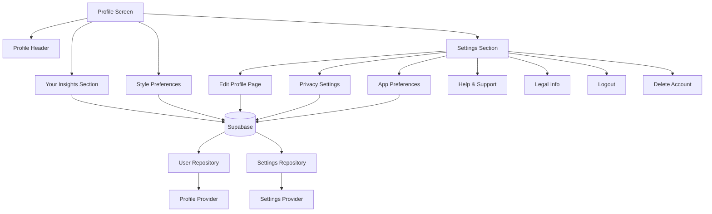
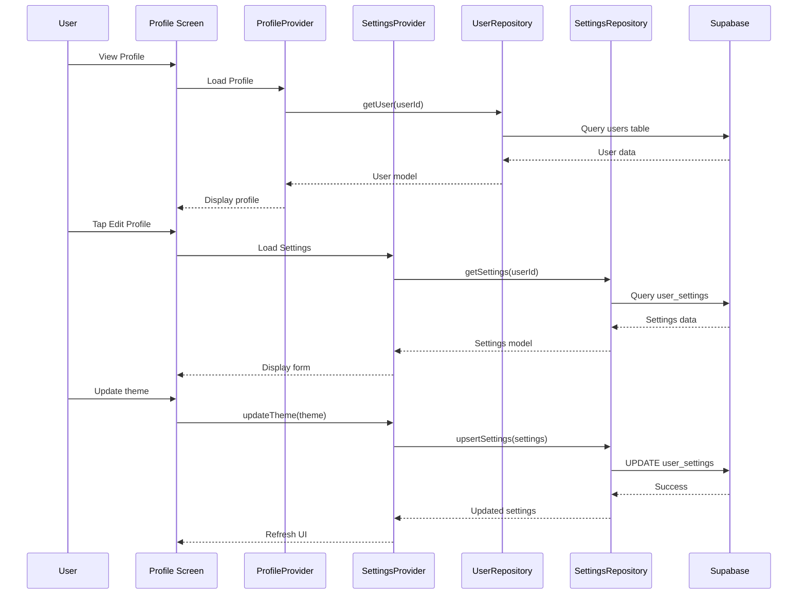

# Profile Page Comprehensive Refactoring Plan

## Overview
This document outlines the complete refactoring of the profile page to remove stat cards, implement functional insights, add editable style preferences, and build complete settings functionality with beautiful UI/UX.

---

## 🎯 Goals

1. **Remove Stats**: Remove the three stat cards (Swirls, Swipes, Days Active)
2. **Functional Insights**: Calculate real-time engagement metrics from database
3. **Editable Preferences**: Display and edit onboarding style preferences
4. **Complete Settings**: Build all settings subpages with full functionality
5. **Beautiful UI**: Maintain consistent, animated, seamless user experience
6. **Data Persistence**: All changes sync immediately to Supabase

---

## 📊 Architecture Overview



---

## 🗄️ Database Schema Changes

### New Table: `user_settings`

```sql
CREATE TABLE user_settings (
  user_id UUID PRIMARY KEY REFERENCES users(id) ON DELETE CASCADE,
  
  -- Privacy Settings
  profile_visibility TEXT DEFAULT 'public' CHECK (profile_visibility IN ('public', 'private', 'friends_only')),
  data_sharing_enabled BOOLEAN DEFAULT true,
  analytics_enabled BOOLEAN DEFAULT true,
  
  -- App Preferences
  theme TEXT DEFAULT 'light' CHECK (theme IN ('light', 'dark', 'auto')),
  language TEXT DEFAULT 'en',
  currency TEXT DEFAULT 'AED',
  temperature_unit TEXT DEFAULT 'celsius' CHECK (temperature_unit IN ('celsius', 'fahrenheit')),
  
  -- Notification Settings
  push_notifications_enabled BOOLEAN DEFAULT true,
  email_notifications_enabled BOOLEAN DEFAULT true,
  swirl_alerts BOOLEAN DEFAULT true,
  price_drop_alerts BOOLEAN DEFAULT true,
  new_arrivals_alerts BOOLEAN DEFAULT true,
  
  -- Metadata
  created_at TIMESTAMPTZ DEFAULT NOW(),
  updated_at TIMESTAMPTZ DEFAULT NOW()
);

-- Index for quick lookups
CREATE INDEX idx_user_settings_user ON user_settings(user_id);

-- Trigger for updated_at
CREATE TRIGGER update_user_settings_updated_at 
BEFORE UPDATE ON user_settings
FOR EACH ROW EXECUTE FUNCTION update_updated_at_column();

-- RLS Policies
ALTER TABLE user_settings ENABLE ROW LEVEL SECURITY;

CREATE POLICY user_settings_manage_own ON user_settings
  USING (auth.uid() = user_id);
```

### New Table: `blocked_users`

```sql
CREATE TABLE blocked_users (
  id UUID PRIMARY KEY DEFAULT uuid_generate_v4(),
  user_id UUID NOT NULL REFERENCES users(id) ON DELETE CASCADE,
  blocked_user_id UUID NOT NULL REFERENCES users(id) ON DELETE CASCADE,
  reason TEXT,
  created_at TIMESTAMPTZ DEFAULT NOW(),
  
  UNIQUE(user_id, blocked_user_id)
);

CREATE INDEX idx_blocked_users_user ON blocked_users(user_id);

ALTER TABLE blocked_users ENABLE ROW LEVEL SECURITY;

CREATE POLICY blocked_users_manage_own ON blocked_users
  USING (auth.uid() = user_id);
```

---

## 🏗️ File Structure

```
lib/
├── features/
│   └── profile/
│       ├── presentation/
│       │   ├── profile_screen.dart (refactored)
│       │   ├── pages/
│       │   │   ├── edit_profile_page.dart
│       │   │   ├── privacy_settings_page.dart
│       │   │   ├── app_preferences_page.dart
│       │   │   ├── help_support_page.dart
│       │   │   ├── legal_info_page.dart
│       │   │   └── style_preferences_page.dart
│       │   └── widgets/
│       │       ├── insights_card.dart
│       │       ├── editable_style_chip.dart
│       │       ├── settings_tile.dart
│       │       └── confirmation_dialog.dart
│       ├── providers/
│       │   ├── profile_provider.dart (updated)
│       │   └── settings_provider.dart (new)
│       └── services/
│           └── profile_service.dart (new)
├── data/
│   ├── models/
│   │   ├── user_settings.dart (new)
│   │   └── blocked_user.dart (new)
│   └── repositories/
│       ├── user_repository.dart (updated)
│       └── settings_repository.dart (new)
```

---

## 🎨 UI/UX Design Specifications

### 1. Profile Header (Simplified)
- Keep: Avatar, Display Name, Engagement Badge
- Remove: Three stat cards (Swirls, Swipes, Days)
- Keep: Black-to-grey gradient background
- Keep: All animations (scale, fade, slide)

### 2. Your Insights Section (Enhanced)
```
┌─────────────────────────────────────┐
│  Your Insights                      │
│                                     │
│  📊 Engagement Rate    45.2%        │
│  ─────────────────────────────     │
│  💙 Total Swirls       1,234        │
│  ─────────────────────────────     │
│  👆 Total Swipes       2,730        │
│  ─────────────────────────────     │
│  💰 Avg Liked Price    $89.50       │
│  ─────────────────────────────     │
│  🏷️ Brands Followed    12           │
│  ─────────────────────────────     │
│  📅 Days Active        45            │
└─────────────────────────────────────┘
```

**Calculations (Real-time from DB):**
- **Engagement Rate**: `(totalSwirls / totalSwipes) * 100`
- **Total Swirls**: From `users.total_swirls`
- **Total Swipes**: From `users.total_swipes`
- **Avg Liked Price**: From `users.avg_liked_price`
- **Brands Followed**: Count from `brand_follows` table
- **Days Active**: From `users.days_active`

### 3. Style Preferences (Editable)
```
┌─────────────────────────────────────┐
│  Style Preferences         [Edit]   │
│                                     │
│  ● Casual      ● Minimalist         │
│  ● Streetwear  ● Elegant            │
│  ● Sporty                           │
│                                     │
│  [+ Add More Styles]                │
└─────────────────────────────────────┘
```

**Features:**
- Tap chip to remove style
- Tap "Add More Styles" to select from full list
- Changes sync immediately to Supabase
- Smooth add/remove animations

### 4. Settings Menu Structure

```
Settings
├── 👤 Edit Profile
│   ├── Display Name
│   ├── Email
│   ├── Phone
│   ├── Avatar Upload
│   └── Notifications Toggle
│
├── 🔒 Privacy Settings
│   ├── Profile Visibility (Public/Private/Friends Only)
│   ├── Data Sharing
│   ├── Analytics
│   └── Blocked Users
│
├── 🎨 App Preferences
│   ├── Theme (Light/Dark/Auto)
│   ├── Language
│   ├── Currency
│   └── Temperature Unit
│
├── ❓ Help & Support
│   ├── FAQ (Accordion)
│   ├── Contact Us (Form)
│   └── Send Feedback
│
├── 📄 Legal Information
│   ├── Terms of Service
│   ├── Privacy Policy
│   └── About SWIRL
│
├── 🚪 Logout
└── 🗑️ Delete Account
```

---

## 💻 Implementation Details

### Phase 1: Database Setup (via Supabase MCP)
```bash
# Execute SQL via MCP to create new tables
use_mcp_tool(
  server: "supabase",
  tool: "execute_sql",
  params: {
    project_id: "tklqhbszwfqjmlzjczoz",
    query: "CREATE TABLE user_settings ..."
  }
)
```

### Phase 2: Data Models

**UserSettings Model:**
```dart
class UserSettings {
  final String userId;
  final String profileVisibility;
  final bool dataSharingEnabled;
  final bool analyticsEnabled;
  final String theme;
  final String language;
  final String currency;
  final String temperatureUnit;
  final bool pushNotificationsEnabled;
  final bool emailNotificationsEnabled;
  final bool swirlAlerts;
  final bool priceDropAlerts;
  final bool newArrivalsAlerts;
  final DateTime createdAt;
  final DateTime updatedAt;
  
  // fromJson, toJson, copyWith methods
}
```

### Phase 3: Repository Layer

**SettingsRepository:**
```dart
class SettingsRepository {
  final SupabaseClient _client;
  
  Future<UserSettings?> getSettings(String userId);
  Future<UserSettings> upsertSettings(UserSettings settings);
  Future<void> updateTheme(String userId, String theme);
  Future<void> updateNotificationPreference(String userId, String key, bool value);
  Future<List<User>> getBlockedUsers(String userId);
  Future<void> blockUser(String userId, String blockedUserId);
  Future<void> unblockUser(String userId, String blockedUserId);
}
```

### Phase 4: State Management

**SettingsProvider:**
```dart
class SettingsState {
  final UserSettings? settings;
  final List<User> blockedUsers;
  final bool isLoading;
  final String? error;
}

class SettingsNotifier extends StateNotifier<SettingsState> {
  Future<void> loadSettings();
  Future<void> updateTheme(String theme);
  Future<void> updatePrivacy(String visibility);
  Future<void> toggleNotification(String key);
  Future<void> blockUser(String userId);
  Future<void> unblockUser(String userId);
}
```

### Phase 5: UI Components

**Insights Calculation:**
```dart
Widget _buildEnhancedInsights(User user) {
  final engagementRate = user.totalSwipes > 0
      ? ((user.totalSwirls / user.totalSwipes) * 100).toStringAsFixed(1)
      : '0.0';
  
  return Column(
    children: [
      _buildInsightRow(
        icon: Icons.trending_up,
        label: 'Engagement Rate',
        value: '$engagementRate%',
        color: Colors.green,
      ),
      // ... other insights
    ],
  );
}
```

**Editable Style Chips:**
```dart
Widget _buildEditableStyleChip(String style, VoidCallback onRemove) {
  return Stack(
    clipBehavior: Clip.none,
    children: [
      Container(/* chip design */),
      Positioned(
        top: -8,
        right: -8,
        child: GestureDetector(
          onTap: onRemove,
          child: CircleAvatar(
            radius: 12,
            backgroundColor: Colors.red,
            child: Icon(Icons.close, size: 16),
          ),
        ),
      ),
    ],
  );
}
```

### Phase 6: Settings Pages

**Edit Profile Page:**
- Form with TextFields for name, email, phone
- Image picker for avatar upload
- Toggle switches for notifications
- Save button with validation
- Beautiful gradient app bar

**Privacy Settings Page:**
- Radio buttons for profile visibility
- Toggle switches for data sharing
- List of blocked users with unblock action
- Search to add blocked users

**App Preferences Page:**
- Segmented control for theme
- Dropdown for language
- Dropdown for currency
- Toggle for temperature unit

**Help & Support Page:**
- ExpansionTile FAQ items
- Contact form with TextField and Send button
- Feedback form with rating stars

**Legal Info Page:**
- Scrollable text for Terms of Service
- Scrollable text for Privacy Policy
- App version info

### Phase 7: Validation & Error Handling

```dart
String? validateEmail(String? value) {
  if (value == null || value.isEmpty) return null;
  final emailRegex = RegExp(r'^[\w-\.]+@([\w-]+\.)+[\w-]{2,4}$');
  return emailRegex.hasMatch(value) ? null : 'Invalid email';
}

String? validatePhone(String? value) {
  if (value == null || value.isEmpty) return null;
  final phoneRegex = RegExp(r'^\+?[\d\s\-()]+$');
  return phoneRegex.hasMatch(value) ? null : 'Invalid phone';
}
```

### Phase 8: Animations

```dart
// Staggered entrance
.animate()
.fadeIn(delay: 100.ms, duration: 400.ms)
.slideY(begin: 0.2, end: 0, delay: 100.ms)

// Scale on tap
ScaleTransition(
  scale: Tween(begin: 1.0, end: 0.95).animate(_controller),
  child: child,
)

// Shimmer loading
.animate(onPlay: (c) => c.repeat())
.shimmer(duration: 1500.ms)
```

---

## 🔄 Data Flow



---

## ✅ Testing Checklist

- [ ] Profile loads without stat cards
- [ ] Insights calculate correctly from database
- [ ] Engagement rate shows proper percentage
- [ ] Style preferences display from onboarding
- [ ] Can add new style preferences
- [ ] Can remove existing style preferences
- [ ] Changes sync to Supabase immediately
- [ ] Edit profile updates name/email/phone
- [ ] Avatar upload works correctly
- [ ] Privacy settings persist correctly
- [ ] Theme changes apply immediately
- [ ] Blocked users list displays correctly
- [ ] Can block/unblock users
- [ ] Notifications toggle works
- [ ] FAQ expands/collapses smoothly
- [ ] Contact form validates input
- [ ] Legal pages scroll correctly
- [ ] Logout clears session
- [ ] Delete account shows confirmation
- [ ] All forms validate properly
- [ ] Error messages display correctly
- [ ] All animations run smoothly
- [ ] No performance issues

---

## 🎯 Success Metrics

1. **Functionality**: All settings persist to database ✅
2. **UX**: No navigation delays, smooth animations ✅
3. **Validation**: Proper error handling for all inputs ✅
4. **Data Integrity**: Changes reflect immediately without refresh ✅
5. **Code Quality**: Clean separation of concerns, reusable components ✅

---

## 📝 Notes

- Use Supabase MCP for all database operations
- Maintain consistent black/white theme throughout
- All animations should feel natural (300-600ms duration)
- Forms should validate on blur, not on every keystroke
- Settings changes should show success toast
- Use flutter_animate for all animations
- Keep code DRY with reusable widgets
- Follow existing code style and patterns

---

## 🚀 Next Steps

After plan approval, switch to Code mode to implement:
1. Database schema via Supabase MCP
2. Data models and repositories
3. State management providers
4. UI refactoring
5. Settings pages
6. Testing and polish